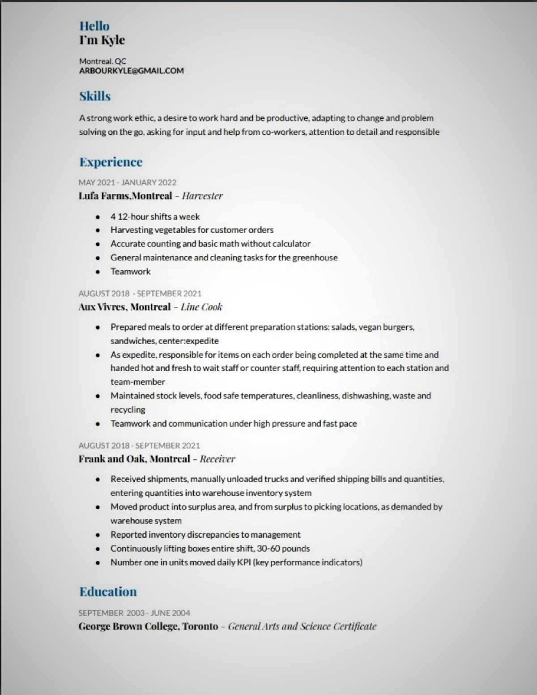

layout: page
title: "RESUME"
permalink: https://arbourkyle.github.io/thirdPortfoliokyletylerarbour82//blob/main/resume.html

<!DOCTYPE html>
<html lang="en">
<head>
	<meta charset="UTF-8">
	<meta http-equiv="X-UA-Compatible" content="IE=edge">
	<meta name="viewport" content="width=device-width, initial-scale=1.0">
	<link rel="stylesheet" href="assets/css/main.css" />
	<title>Kyle's Resume</title>
</head>
<body id="resume">

	
	
	
	
	<!--[if lte IE 8]><![endif]-->
	
</body>
</html>
